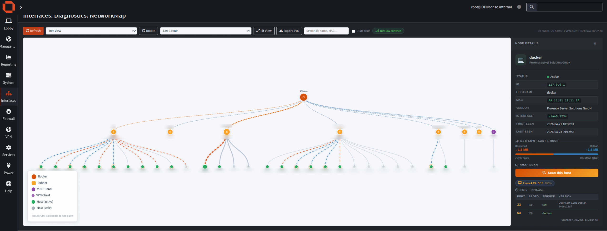
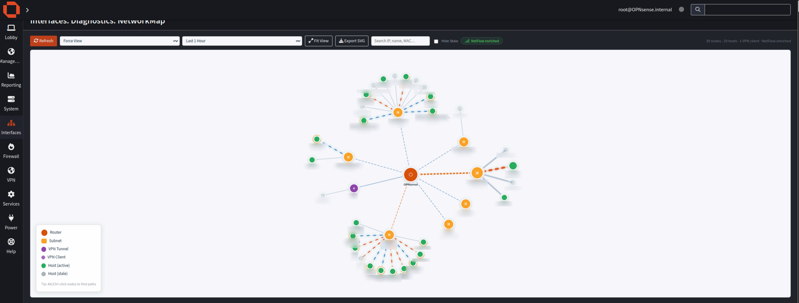

# os-netmap

Interactive network topology map for [OPNsense](https://opnsense.org). Appears under **Interfaces → Diagnostics → Network Map**.

## Screenshots

### Tree View


### Force View


## Features

- **Two layouts** — hierarchical tree and force-directed graph
- **Live topology** — discovers interfaces, subnets, hosts, and VPN tunnels from OPNsense config and hostwatch
- **NetFlow enrichment** — node size and link color reflect real traffic (download/upload) when Insight capture is enabled; windows from 5 min to 7 days
- **Hostname resolution** — resolves IPs via dnsmasq leases, Unbound PTR records, and static DHCP config
- **Node detail panel** — MAC, vendor, first/last seen, interface, NetFlow stats per host
- **On-demand nmap scan** — async OS + port scan per host, rate-limited to one scan per IP per 5 minutes
- **Search** — filter nodes by IP, hostname, or MAC
- **Hide stale** — toggle hosts not seen in 24 h
- **SVG export** — download current topology as SVG
- **Dashboard widget** — mini radial map + traffic table on the OPNsense home page

## Requirements

- OPNsense 24.x or later
- `nmap` package (installed automatically as a dependency)
- **Reporting → NetFlow → Settings → Capture Local** enabled for traffic enrichment (optional)

## Installation

### From package (recommended)

```sh
pkg install os-netmap
```

### From source

```sh
git clone https://github.com/bitwire-it/os-netmap.git
cd os-netmap
make install   # deploys src/ tree to the running OPNsense system
```

## Build

```sh
make lint      # PHP + Python syntax checks
make style     # style checks
make package   # build FreeBSD .pkg
```

## License

BSD 2-Clause
